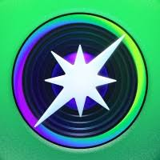
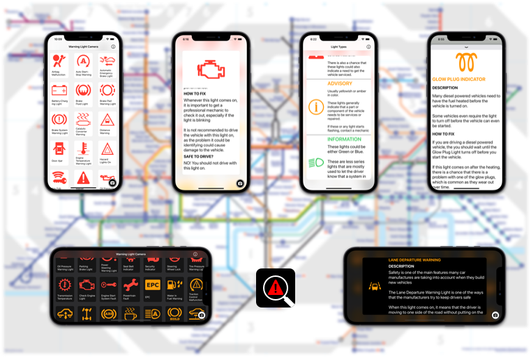
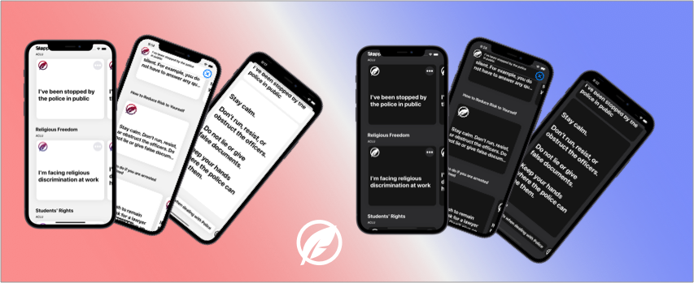

## My iOS Developer Portfolio
# Sam Greenhill

A self-taught iOS Engineer, proficient in application development and with start-up experience. I developed two apps for the Apple App Store by myself, and have worked at a fast paced start-up. I love to learn and use my skills to develop mobile applications. 

# Special Skills:
* Swift, UIKit, SwiftUI, iOS Development, iOS SDK, XCTests, Test-Driven-Development
* JSON, REST API
* UI Design, UX Design, Sketch
* Github
* Cocoapods, Carthage
* Agile Development
* Telecommunication
* Combine, Reactive Programming 
* UI Testing, UX Testing
* MVC and MVVM Design Pattern, Clean Architecture Pattern

# Work Experience:

## Dispo: Live in the moment 
[Dispo: Live in the moment](https://apps.apple.com/us/app/dispo-digital-disposable-cam/id1491684197) 

Contract Position: Feb 2022 - May 2022

Responsibilities: 
* Help make custom changes to the Dispo App
* Collaborate with backend and design teams to update and develop new features
* Helped move code base from UIKit to SwiftUI
* Participate in team code reviews
* Fix bugs

# My Projects:

## Warning Light Camera 

[Warning Light Camera](https://apps.apple.com/us/app/warning-light-camera/id1465343815?ls=1) is an encyclopedia of dashboard lights from most vehicles on the road today. Using XCode's CreateML to produce an image recognition app that can actually identify the possible warning lights that have appeared. Each light comes with a detailed description, cause, procedure to turn off, as well as telling you the most important question, Can I Still Drive?

##### Technologies: Swift, CoreML, Vision Framework, Google AdMob, JSON, MVC

  
  
## QUIPP-Rights, Voting, Freedom 
  
[QUIPP](https://apps.apple.com/us/app/quipp-rights-voting-freedom/id1535290604) is a free source of many of the freedoms and rights that Americans have in this country. This information is taken from the [ACLU]("https://www.aclu.org"), but not affiliated with them, which contains information ranging from rights in school, and voting rights. Each right comes with scenarios, examples, and helpful links and phone numbers to try and help anyone who does and wants to call America home. 
  
##### Technologies: Swift, Diffable Data Source, JSON, MVC
  

 
  
# Code Examples
  
  
##### ViewModel:   
  
  
| ViewModel: |  |
| --- | --- |
| <a href="https://github.com/samgusa/OmadaHealthApp/blob/main/OmadaHealthApp/ViewModel/MainViewModel.swift" target="_blank"> | &nbsp;&nbsp;&nbsp;&nbsp;&nbsp;&nbsp;&nbsp;&nbsp;&nbsp;&nbsp;&nbsp;&nbsp;&nbsp;&nbsp;&nbsp;&nbsp;&nbsp;&nbsp;&nbsp;&nbsp;&nbsp;&nbsp;&nbsp;&nbsp;&nbsp;&nbsp;</a>&nbsp;&nbsp;&nbsp;&nbsp;&nbsp;&nbsp;&nbsp;&nbsp;&nbsp;&nbsp;&nbsp;&nbsp;&nbsp;&nbsp;&nbsp;&nbsp;&nbsp;&nbsp;&nbsp;&nbsp;&nbsp;&nbsp;&nbsp;&nbsp;&nbsp;&nbsp; |

| View: | Model: |
| --- | --- |
| <a href="https://github.com/samgusa/OmadaHealthApp/blob/main/OmadaHealthApp/View/View/MainView.swift" target="_blank"> | <a href="https://github.com/samgusa/OmadaHealthApp/blob/main/OmadaHealthApp/Model/QuoteData.swift" target="_blank"> |

  
| Custom Transition |  |
| --- | --- |
|  | &nbsp;&nbsp;&nbsp;&nbsp;&nbsp;&nbsp;&nbsp;&nbsp;&nbsp;&nbsp;&nbsp;&nbsp;&nbsp;&nbsp;&nbsp;&nbsp;&nbsp;&nbsp;&nbsp;&nbsp;&nbsp;&nbsp;&nbsp;&nbsp;&nbsp;&nbsp;&nbsp;</a>&nbsp;&nbsp;&nbsp;&nbsp;&nbsp;&nbsp;&nbsp;&nbsp;&nbsp;&nbsp;&nbsp;&nbsp;&nbsp;&nbsp;&nbsp;&nbsp;&nbsp;&nbsp;&nbsp;&nbsp;&nbsp;&nbsp;&nbsp;&nbsp;&nbsp;&nbsp;&nbsp; |
  

# Contacts:
*Do not hesitate to contact me.*

&nbsp;&nbsp;&nbsp;&nbsp;&nbsp;&nbsp;&nbsp;&nbsp;&nbsp;&nbsp;&nbsp;&nbsp;
