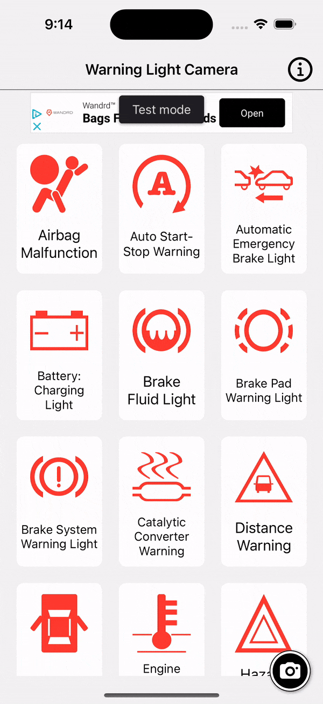
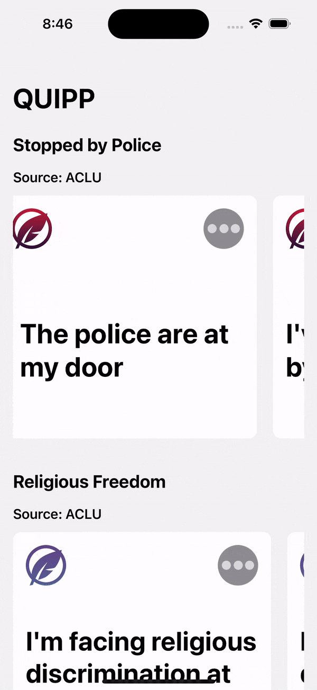
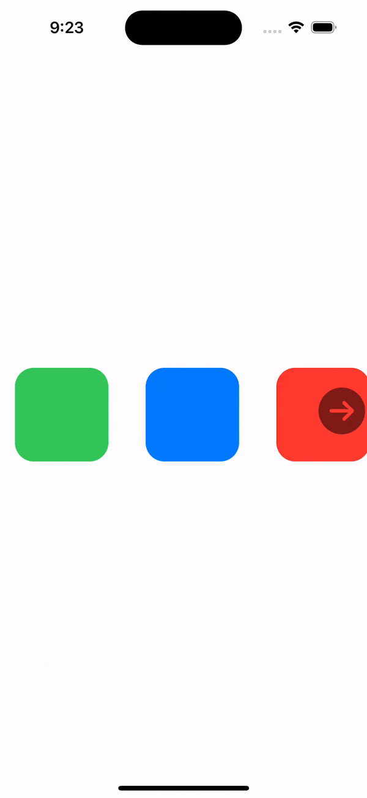
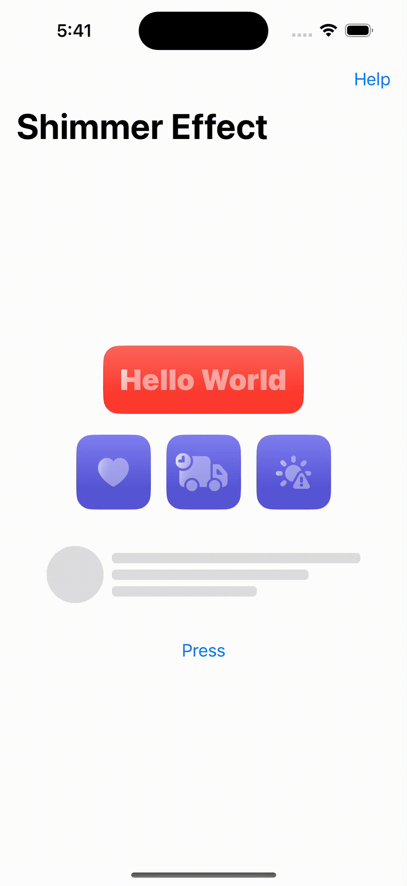
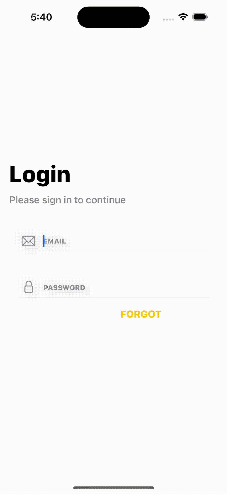

## My iOS Developer Portfolio
# Sam Greenhill

Experienced iOS Developer proficient in Swift, UIKit, SwiftUI, and Combine Reactive Programming. Skilled in both MVC and MVVM design patterns, with a focus on Agile development and UI/UX design. Being a self-taught iOS Engineer, I am proficient in application development and experienced with start-ups. I developed two apps for the Apple App Store by myself, and have worked at two fast paced start-ups. I love to learn and use my skills to develop mobile applications. 

# Special Skills:

**Programming and Development:** 
* Swift
* UIKit
* SwiftUI
* iOS Development
* iOS SDK
* Test-Driven Development (TDD)
* XCTest (iOS Testing Framework)
* JSON and REST API Integration

**Design and User Experience:**
* UI Design
* UX Design
* Sketch (Design Software)
* Figma (Design Software)

**Version Control and Collaboration:**
* Git and GitHub
* Cocoapods and Carthage (Dependency Managers)
* Agile Development (Scrum and Kanban)
* Telecommunication (Communication Tools for Remote Teams)

**Reactive Programming:**
* Combine Framework
* Reactive Programming Principles

**Testing and Quality Assurance:**
* UI Testing (User Interface Testing)
* UX Testing (User Experience Testing)

  
**Architectural Patterns:**
* MVC (Model-View-Controller)
* MVVM (Model-View-ViewModel)
* Clean Architecture Pattern

  
**Project Management:**
* Jira (Project Management and Issue Tracking)

# Work Experience:

## Fourplay Social  
[Fourplay Social](https://apps.apple.com/us/app/fourplay-double-dating-app/id1463551449) 

Jan 2023 - Present

Responsibilities: 
* Contributed to Growing Dating App Development:
  - Played a vital role in the development of a thriving dating app with a rapidly expanding user base, contributing to the app's success and popularity.
* Led Front-End Enhancements with SwiftUI:
  - Took charge of and expedited front-end design improvements using SwiftUI, resulting in elevated user experiences and a visually engaging interface.
* Collaborated with Lead Developer for Front-End Expansion:
  - Collaborated seamlessly with the lead developer to extend and enhance front-end capabilities, effectively contributing to the app's feature-rich design.
* Efficient Task Management via Jira:
  - Utilized Jira to facilitate efficient tracking of issues and tasks, streamlining project management processes and ensuring seamless coordination within the team.
* Initiated Lottie Animations Implementation:
  - Pioneered the successful integration of Lottie animations, elevating the app's visual appeal and user engagement through captivating motion graphics.

## Dispo: Live in the moment 
[Dispo: Live in the moment](https://apps.apple.com/us/app/dispo-digital-disposable-cam/id1491684197) 

Contract Position: Feb 2022 - May 2022

Responsibilities:

* Designed Efficient and Reusable Codebase for Dispo App:
  - Developed and architected robust, maintainable, and reusable code for the Dispo app, resulting in improved development efficiency and code quality.
* Collaborated Cross-Functionally for Feature Enhancement:
  - Worked closely with both backend and design teams to conceptualize, develop, and roll out innovative new features, contributing to enhanced user experiences and increased engagement.
* Integrated Backend Logic Seamlessly with GraphQL:
  - Successfully integrated backend logic into the app using GraphQL, ensuring efficient and streamlined data communication between the front-end and back-end components.
* Drove Migration from UIKit to SwiftUI:
  - Played an integral role in transitioning the app's codebase from UIKit to SwiftUI, leveraging the latest technology to deliver a modern and visually appealing user interface.
* Engaged in Collaborative Code Reviews:
  - Actively participated in team-wide code reviews, offering constructive feedback and ensuring code alignment with best practices, resulting in a higher standard of code quality and consistency.
* Enhanced App Quality Through Bug Diagnosis and Resolution:
  - Demonstrated a strong debugging acumen by promptly identifying and resolving application bugs, leading to an improved user experience, higher app ratings, and increased customer satisfaction.

# My Projects:

## Warning Light Camera 

[Warning Light Camera](https://apps.apple.com/us/app/warning-light-camera/id1465343815?ls=1) is an encyclopedia of dashboard lights from most vehicles on the road today. Using XCode's CreateML to produce an image recognition app that can actually identify the possible warning lights that have appeared. Each light comes with a detailed description, cause, procedure to turn off, as well as telling you the most important question, Can I Still Drive?

##### Technologies: Swift, CoreML, Vision Framework, Google AdMob, JSON, MVVM

  
  
## QUIPP-Rights, Voting, Freedom 
  
[QUIPP](https://apps.apple.com/us/app/quipp-rights-voting-freedom/id1535290604) is a free source of many of the freedoms and rights that Americans have in this country. This information is taken from the [ACLU]("https://www.aclu.org"), but not affiliated with them, which contains information ranging from rights in school, and voting rights. Each right comes with scenarios, examples, and helpful links and phone numbers to try and help anyone who does and wants to call America home. 
  
##### Technologies: Swift, SwiftUI, JSON, MVVM
  

 
  
# Code Examples
 
| UIKit | [See In Real Time](https://apps.apple.com/us/app/warning-light-camera/id1465343815?ls=1) |
| --- | --- |
|  | &nbsp;&nbsp;&nbsp;&nbsp;&nbsp;&nbsp;&nbsp;&nbsp;&nbsp;&nbsp;&nbsp;&nbsp;&nbsp;&nbsp;&nbsp;&nbsp;&nbsp;&nbsp;&nbsp;&nbsp;&nbsp;&nbsp;&nbsp;&nbsp;&nbsp;&nbsp;&nbsp;&nbsp;&nbsp;&nbsp;&nbsp;&nbsp;&nbsp;&nbsp;&nbsp;&nbsp;&nbsp;&nbsp;&nbsp;&nbsp;&nbsp;&nbsp;&nbsp;&nbsp;&nbsp;&nbsp;&nbsp;&nbsp;&nbsp;&nbsp;&nbsp;&nbsp;&nbsp;&nbsp;&nbsp;&nbsp; |

| SwiftUI | [See In Real Time](https://apps.apple.com/us/app/quipp-rights-voting-freedom/id1535290604) |
| --- | --- |
| &nbsp; | &nbsp;&nbsp;&nbsp;&nbsp;&nbsp;&nbsp;&nbsp;&nbsp;&nbsp;&nbsp;&nbsp;&nbsp;&nbsp;&nbsp;&nbsp;&nbsp;&nbsp;&nbsp;&nbsp;&nbsp;&nbsp;&nbsp;&nbsp;&nbsp;&nbsp;&nbsp;&nbsp;&nbsp;&nbsp;&nbsp;&nbsp;&nbsp;&nbsp;&nbsp;&nbsp;&nbsp;&nbsp;&nbsp;&nbsp;&nbsp;&nbsp;&nbsp;&nbsp;&nbsp;&nbsp;&nbsp;&nbsp;&nbsp;&nbsp;&nbsp;&nbsp;&nbsp;&nbsp;&nbsp;&nbsp;&nbsp; |
  
| ViewModel: | Combine |
| --- | --- |
| <a href="https://github.com/samgusa/OmadaHealthApp/blob/main/OmadaHealthApp/ViewModel/MainViewModel.swift" target="_blank"> |  |

| View: | Model: |
| --- | --- |
| <a href="https://github.com/samgusa/OmadaHealthApp/blob/main/OmadaHealthApp/View/View/MainView.swift" target="_blank"> | <a href="https://github.com/samgusa/OmadaHealthApp/blob/main/OmadaHealthApp/Model/QuoteData.swift" target="_blank"> |
  
| Custom Transition | [See In Real Time](https://apps.apple.com/us/app/warning-light-camera/id1465343815?ls=1) |
| --- | --- |
|  | &nbsp;&nbsp;&nbsp;&nbsp;&nbsp;&nbsp;&nbsp;&nbsp;&nbsp;&nbsp;&nbsp;&nbsp;&nbsp;&nbsp;&nbsp;&nbsp;&nbsp;&nbsp;&nbsp;&nbsp;&nbsp;&nbsp;&nbsp;&nbsp;&nbsp;&nbsp;&nbsp;</a>&nbsp;&nbsp;&nbsp;&nbsp;&nbsp;&nbsp;&nbsp;&nbsp;&nbsp;&nbsp;&nbsp;&nbsp;&nbsp;&nbsp;&nbsp;&nbsp;&nbsp;&nbsp;&nbsp;&nbsp;&nbsp;&nbsp;&nbsp;&nbsp;&nbsp;&nbsp;&nbsp; |
  
| Custom SwiftUI | [See In Real Time](https://github.com/samgusa/ArrowTest) |
| --- | --- |
|  | &nbsp;&nbsp;&nbsp;&nbsp;&nbsp;&nbsp;&nbsp;&nbsp;&nbsp;&nbsp;&nbsp;&nbsp;&nbsp;&nbsp;&nbsp;&nbsp;&nbsp;&nbsp;&nbsp;&nbsp;&nbsp;&nbsp;&nbsp;&nbsp;&nbsp;&nbsp;&nbsp;</a>&nbsp;&nbsp;&nbsp;&nbsp;&nbsp;&nbsp;&nbsp;&nbsp;&nbsp;&nbsp;&nbsp;&nbsp;&nbsp;&nbsp;&nbsp;&nbsp;&nbsp;&nbsp;&nbsp;&nbsp;&nbsp;&nbsp;&nbsp;&nbsp;&nbsp;&nbsp;&nbsp; |

# Check out Cool and Fun Animations
  [https://github.com/samgusa/FunAnimations/tree/main](https://github.com/samgusa/FunAnimations/tree/main)

&nbsp;&nbsp;&nbsp;&nbsp;&nbsp;&nbsp;&nbsp;&nbsp;&nbsp;&nbsp;&nbsp;&nbsp;

&nbsp;&nbsp;&nbsp;&nbsp;&nbsp;&nbsp;&nbsp;&nbsp;&nbsp;&nbsp;&nbsp;&nbsp;

&nbsp;&nbsp;&nbsp;&nbsp;&nbsp;&nbsp;&nbsp;&nbsp;&nbsp;&nbsp;&nbsp;&nbsp;

&nbsp;&nbsp;&nbsp;&nbsp;&nbsp;&nbsp;&nbsp;&nbsp;&nbsp;&nbsp;&nbsp;&nbsp;

# Contacts:
*Do not hesitate to contact me.*

&nbsp;&nbsp;&nbsp;&nbsp;&nbsp;&nbsp;&nbsp;&nbsp;&nbsp;&nbsp;&nbsp;&nbsp;
