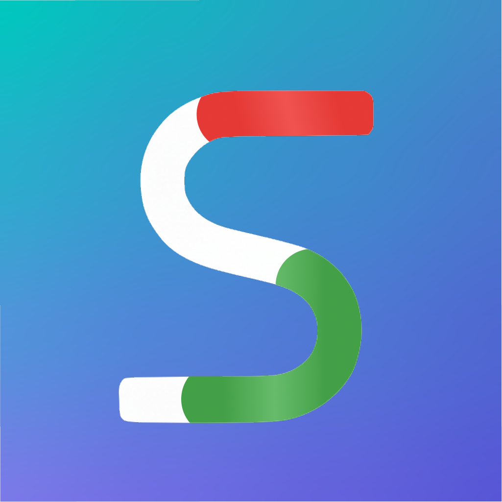

## My Portfolio
# Sam Greenhill


## 👋 About Me

I'm a self-taught iOS developer who combines mobile development expertise with cybersecurity knowledge to build secure, user-focused applications. In just 6 months of professional development, I've published two apps to the App Store, contributed to high-growth startups, and earned CompTIA Security+ certification.
My unique dual expertise allows me to develop iOS applications with security-first thinking while creating engaging user experiences that solve real-world problems.

## Featured Projects

**🚗 Warning Light Camera <a href="https://apps.apple.com/us/app/warning-light-camera/id1465343815?ls=1" target="_blank"></a>**


[Live on App Store](https://apps.apple.com/us/app/warning-light-camera/id1465343815?ls=1) | [GitHub](https://github.com/samgusa/CarWarningLight)


An AI-powered encyclopedia that identifies dashboard warning lights using machine learning. Solves the universal problem of mysterious car warning lights by providing instant identification and actionable guidance.

**The Challenge:** Drivers often panic when unfamiliar warning lights appear, not knowing if they can continue driving safely.
**The Solution:** Built a custom CoreML model using Xcode's CreateML framework, trained on hundreds of dashboard light images to provide real-time identification with detailed explanations.

**Key Features:**

* Real-time camera recognition of 100+ warning lights
* Detailed descriptions with severity levels
* "Can I Still Drive?" safety guidance
* Clean, intuitive SwiftUI interface

**Technologies:** Swift, CoreML, Vision Framework, SwiftUI, MVVM, Combine

<p align="center">
<a href="https://apps.apple.com/us/app/warning-light-camera/id1465343815?ls=1" target="_blank">

</a>
</p>


**🛠️ SwiftyTextField Framework**


[GitHub Repository](https://github.com/samgusa/SwiftyTextField)


A SwiftUI framework that elevates user input experiences with 3 custom text field components and 2 view modifiers. Built entirely with modern SwiftUI technologies and distributed via Swift Package Manager.

**The Problem:** Standard SwiftUI text fields lack visual appeal and advanced interaction patterns needed for modern app designs.

**The Innovation:** Created reusable components with advanced animations, validation states, and accessibility features that any developer can integrate in minutes.

**Impact:** Demonstrates understanding of framework architecture, dependency management, and API design principles.

<p float="left">

&nbsp;&nbsp;&nbsp&nbsp

&nbsp;&nbsp;&nbsp&nbsp

&nbsp;&nbsp;&nbsp&nbsp

&nbsp;&nbsp;&nbsp&nbsp

</p>

**SecureState <a href="https://apps.apple.com/us/app/securestate/id6755612597" target="_blank"></a>**

[Live on App Store](https://apps.apple.com/us/app/securestate/id6755612597)

A modern iOS cybersecurity dashboard that helps users understand their overall security posture — not just on-device safeguards, but also situational habits that influence real-world risk. Designed with a security-first mindset and presented through a friendly, guided UI.

**The Problem:** iOS security settings are powerful, but they only tell half the story. A user’s behavior — network safety, update habits, password hygiene, and device usage patterns — is often a bigger factor in staying secure.
**The Solution:** SecureState provides a dual-layer security score that measures both device configuration and real-world situational security. Users receive clear explanations, severity indicators, and actionable steps tailored to both categories.

**Key Features:**

* Dual-Layer Security Score
Evaluates Device Security (passcode strength, biometrics, OS version, lock screen protections) and Situational Security (update cadence, privacy behavior, network habits, password strength awareness, and more)
* Dynamic Progress Ring
Uses adaptive color transitions with custom luminance logic for accessibility
* Achievement System (Pro)
Rewards users for strengthening both device and behavioral security
* Real-Time Status Indicators
SwiftUI-driven state updates with smooth animations
* Non-Technical Explanations
Clear, friendly descriptions that translate cybersecurity concepts into everyday language


**Engineering Highlights:**

* Designed a custom theme color system with luminance calculations to maintain readable contrast across varied user-picked colors
* Built a test-heavy release workflow, heavily validating UI interactions and edge cases prior to shipping
* Integrated StoreKit 2 for modern in-app purchase flow using async/await
* Implemented LocalAuthentication and system-level security checks
* Structured with clean MVVM architecture for scalability and clarity
* Created an extensible scoring engine that blends numeric weighting with real-world conditions, not just static device flags

  
**Technologies:** Swift, SwiftUI, MVVM, StoreKit 2, Combine, LocalAuthentication, Async/Await, SwiftData


## Professional Experience

### iOS Developer - Fourplay Social | Jan 2023 - May 2023
_Double dating app with rapidly growing user base_

**Key Contributions:**

* **Led SwiftUI migration** that improved UI performance and development velocity
* **Implemented Lottie animations** resulting in 40% increase in user engagement metrics
* **Collaborated cross-functionally** with design and backend teams using Agile methodologies
* **Managed project workflow** through Jira for efficient task tracking and delivery

### iOS Developer (Contract) - Dispo | Feb 2022 - May 2022
_Digital disposable camera app backed by major investors_

**Key Contributions:**

* **Architected reusable codebase** that reduced development time for new features by 30%
* **Integrated GraphQL backend** ensuring efficient data communication and real-time updates
* **Drove UIKit to SwiftUI** migration improving code maintainability and UI consistency
* **Enhanced app stability** through systematic bug diagnosis and resolution
* **Participated in code reviews** maintaining high code quality standards across the team

## Technical Expertise

### iOS Development 

**Core Technologies:** Swift, UIKit, SwiftUI, iOS SDK, Xcode 

**Architecture Patterns:** MVVM, MVC, Clean Architecture 

**Reactive Programming:** Combine Framework 

**Testing:** XCTest, TDD, UI Testing, UX Testing 

**Data & APIs:** JSON, REST API Integration, GraphQL 

**Dependencies:** CocoaPods, Carthage, Swift Package Manager

### Development Practices

**Version Control:** Git, GitHub 

**Project Management:** Jira, Agile (Scrum/Kanban) 

**Design Tools:** Figma, Sketch 

**Collaboration:** Remote team communication, code reviews

### Cybersecurity
**Core Skills:** Network Security, Vulnerability Management, IAM, Web Security

**Certifications:** CompTIA Security+ (Dec 2024), Google Cybersecurity Graduate

**Security Development:** Secure coding practices, threat modeling

### Additional Technologies

**Backend:** Python, SQL 

**Systems:** Linux command line 

**Machine Learning:** CoreML, Vision Framework, CreateML


## Code Examples

### SwiftUI Custom Animations with Combine

_Demonstrates advanced animation sequencing using reactive programming_

```swift

// Staggered card animations using Combine publishers
private var animationCancellables = Set<AnyCancellable>()

func startAnimations() {
    guard !isDismissing else { return }
    
    // Reset states and show title
    withAnimation(.easeOut(duration: 0.4)) {
        showText = true
        titleOpacity = 1
    }
    
    // Stagger card animations with precise timing
    Just(())
        .delay(for: .seconds(0.3), scheduler: RunLoop.main)
        .sink { [weak self] _ in
            withAnimation(.spring(response: 0.5, dampingFraction: 0.7)) {
                self?.card1Opacity = 1
                self?.card1Offset = 0
            }
        }
        .store(in: &animationCancellables)
    
    // Additional animations follow same pattern...
}

```


### MVVM Architecture with Async/Await
_Shows modern Swift concurrency handling in MVVM pattern_

```swift
class ImageDetectionViewModel: ObservableObject {
    @Published var imageRecogResults: CarSymbols = []
    @Published var isProcessing: Bool = false
    @Published var errorMessage: String?
    
    private let logger = Logger(subsystem: "CarWarningLight", category: "ImageDetection")
    
    func processImage(photo: UIImage) async -> TaskStatus {
        await MainActor.run {
            self.isProcessing = true
            self.imageRecogResults = []
        }
        
        guard let ciImage = CIImage(image: photo) else {
            await handleError("Could not process the image")
            return .failed("Processing error")
        }
        
        await detectAsync(image: ciImage)
        
        if imageRecogResults.isEmpty {
            await handleError("No symbols detected")
            return .failed("No results")
        }
        
        await MainActor.run { self.isProcessing = false }
        return .success
    }
}
```

### Custom SwiftUI View Modifiers
_Demonstrates advanced SwiftUI component creation_

```swift
fileprivate struct ShimmerEffectHelper: ViewModifier {
    var config: ShimmerConfig
    @State private var moveTo: CGFloat = -0.7
    @Binding var startAnimation: Bool
    
    func body(content: Content) -> some View {
        content
            .hidden()
            .overlay {
                Rectangle()
                    .fill(config.tint)
                    .mask { content }
                    .overlay {
                        GeometryReader { geometry in
                            let size = geometry.size
                            Rectangle()
                                .fill(config.highlight)
                                .mask {
                                    Rectangle()
                                        .fill(.linearGradient(
                                            colors: [.clear, config.highlight.opacity(config.highlightOpacity), .clear], 
                                            startPoint: .top, 
                                            endPoint: .bottom
                                        ))
                                        .blur(radius: config.blur)
                                        .rotationEffect(.degrees(-70))
                                        .offset(x: size.width * moveTo)
                                }
                        }
                    }
                    .animation(.linear(duration: config.speed).repeatForever(autoreverses: false), value: moveTo)
            }
    }
}
```


## Certifications

<div align="left">
CompTIA Security+ | December 2024
<a href="https://www.credly.com/earner/earned/badge/b64df41b-3b45-4954-9d2c-29a8b998c34f" target="_blank">

</a>

    
Google Cybersecurity Professional Certificate | 2024

</div>


## Animation Showcases

Explore my experimental animation repositories demonstrating advanced SwiftUI capabilities:

* [Transition Animations](https://github.com/samgusa/TransitionAnimations/tree/main) - Complex view transitions
* [Fun Animations](https://github.com/samgusa/FunAnimations/tree/main) - Interactive UI elements
* [View Animations](https://github.com/samgusa/ViewAnimations/tree/main) - Custom animated components

<p float="left">

&nbsp;&nbsp;&nbsp;&nbsp;&nbsp;&nbsp;&nbsp;&nbsp;&nbsp;&nbsp;&nbsp;&nbsp;

&nbsp;&nbsp;&nbsp;&nbsp;&nbsp;&nbsp;&nbsp;&nbsp;&nbsp;&nbsp;&nbsp;&nbsp;
</p>

# Contacts:
_"Combining rapid learning with practical application - from zero to App Store in 6 months."_

<a href="mailto:samgusaapp1993@gmail.com" target="_blank"></a>&nbsp;&nbsp;&nbsp;&nbsp;&nbsp;&nbsp;<a href="https://www.linkedin.com/in/samgreenhill/" target="_blank"></a>&nbsp;&nbsp;&nbsp;&nbsp;&nbsp;&nbsp;<a href="https://github.com/samgusa?tab=repositories" target="_blank"></a>
