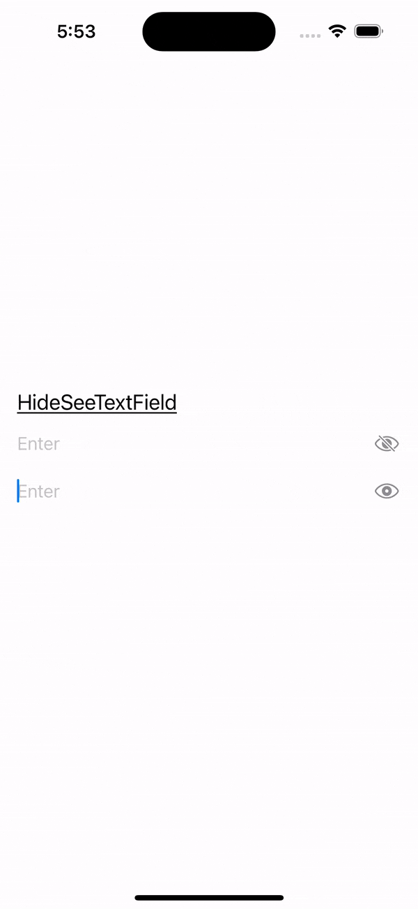
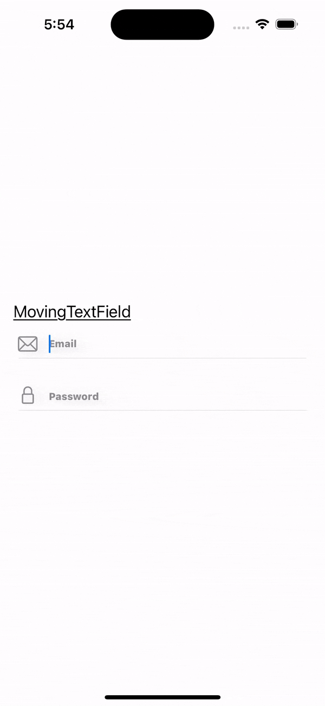
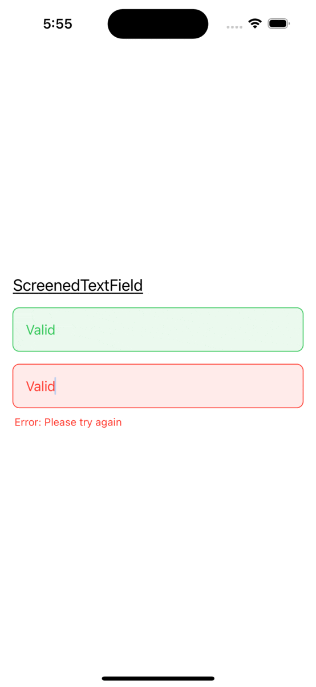
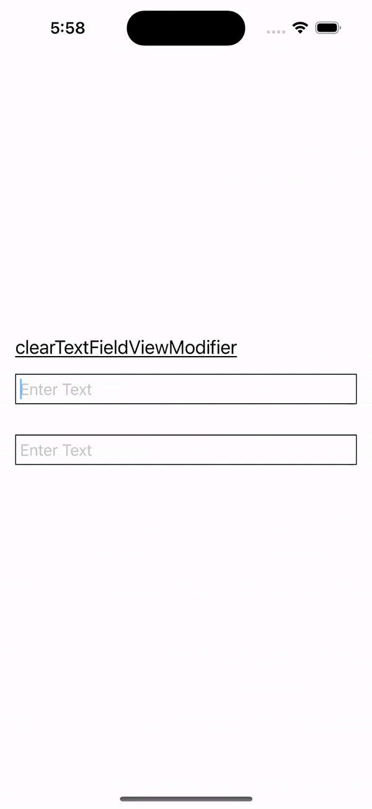
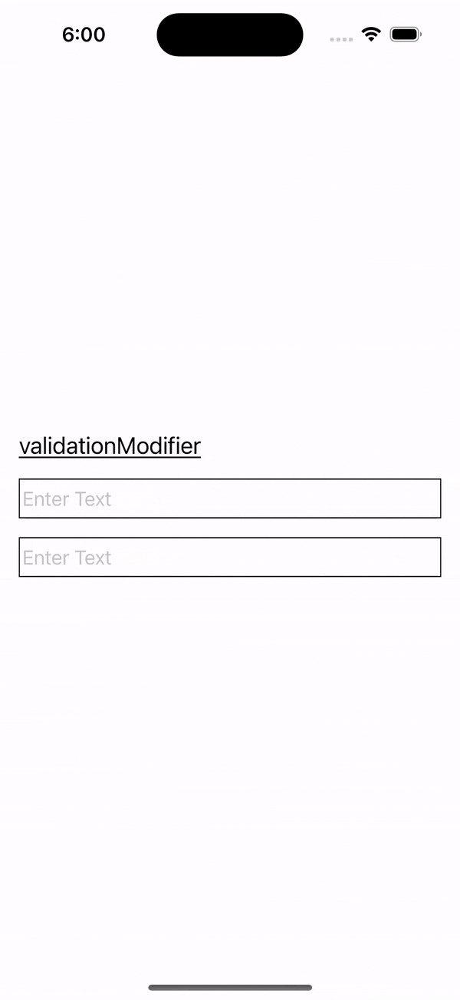

## My Portfolio
# Sam Greenhill


Experienced iOS Developer proficient in Swift, UIKit, SwiftUI, and Combine Reactive Programming. Skilled in both MVC and MVVM design patterns, with a focus on Agile development and UI/UX design. Being a self-taught iOS Engineer, I am proficient in application development and experienced with start-ups. I developed two apps for the Apple App Store by myself, and have worked at two fast paced start-ups. I love to learn and use my skills to develop mobile applications. 

I am also dedicated to cybersecurity, with a passion for safeguarding digital assets and protecting against cyber threats. As a CompTia Security + certified professional, I possess a solid foundation in network security, vulnerability management, and incident response. With a strong emphasis on continuous learning and staying abreast of the latest security trends and technologies, I am committed to ensuring the confidentiality, integrity, and availability of critical information assets. Leveraging my expertise in cybersecurity frameworks and best practices, I excel in analyzing complex security challenges and implementing robust solutions to mitigate risks. Let's connect and explore how I can contribute to your organization's cybersecurity objectives.

# Special Skills:

**Programming and Development:** 
* Swift
* UIKit
* SwiftUI
* iOS Development
* iOS SDK
* Test-Driven Development (TDD)
* XCTest (iOS Testing Framework)
* JSON and REST API Integration

* Python
* SQL
* Linux

**Design and User Experience:**
* UI Design
* UX Design
* Sketch (Design Software)
* Figma (Design Software)

**Version Control and Collaboration:**
* Git and GitHub
* Cocoapods and Carthage (Dependency Managers)
* Agile Development (Scrum and Kanban)
* Telecommunication (Communication Tools for Remote Teams)

**Reactive Programming:**
* Combine Framework
* Reactive Programming Principles

**Testing and Quality Assurance:**
* UI Testing (User Interface Testing)
* UX Testing (User Experience Testing)

  
**Architectural Patterns:**
* MVC (Model-View-Controller)
* MVVM (Model-View-ViewModel)
* Clean Architecture Pattern

  
**Project Management:**
* Jira (Project Management and Issue Tracking)

**Cybersecurity Skills**
* Network Security
* Security Operations
* Vulnerability Management
* Identity and Access Management (IAM)
* Web Security
* Secure Development Practices

**Certifications**

* Google Cybersecurity Certification Graduate:
  
  

* CompTia Security + Certification - Issued December 2024
  


# Work Experience:

## Fourplay Social  <a href="https://apps.apple.com/us/app/fourplay-double-dating-app/id1463551449" target="_blank"></a>
[Fourplay Social](https://apps.apple.com/us/app/fourplay-double-dating-app/id1463551449) 

Jan 2023 - May 2023

**Responsibilities:** 
* Contributed to Growing Dating App Development:
  - Played a vital role in the development of a thriving dating app with a rapidly expanding user base, contributing to the app's success and popularity.
* Led Front-End Enhancements with SwiftUI:
  - Took charge of and expedited front-end design improvements using SwiftUI, resulting in elevated user experiences and a visually engaging interface.
* Collaborated with Lead Developer for Front-End Expansion:
  - Collaborated seamlessly with the lead developer to extend and enhance front-end capabilities, effectively contributing to the app's feature-rich design.
* Efficient Task Management via Jira:
  - Utilized Jira to facilitate efficient tracking of issues and tasks, streamlining project management processes and ensuring seamless coordination within the team.
* Initiated Lottie Animations Implementation:
  - Pioneered the successful integration of Lottie animations, elevating the app's visual appeal and user engagement through captivating motion graphics.

## Dispo: Live in the moment <a href="https://apps.apple.com/us/app/dispo-digital-disposable-cam/id1491684197" target="_blank"></a>
[Dispo: Live in the moment](https://apps.apple.com/us/app/dispo-digital-disposable-cam/id1491684197) 

Contract Position: Feb 2022 - May 2022

**Responsibilities:**

* Designed Efficient and Reusable Codebase for Dispo App:
  - Developed and architected robust, maintainable, and reusable code for the Dispo app, resulting in improved development efficiency and code quality.
* Collaborated Cross-Functionally for Feature Enhancement:
  - Worked closely with both backend and design teams to conceptualize, develop, and roll out innovative new features, contributing to enhanced user experiences and increased engagement.
* Integrated Backend Logic Seamlessly with GraphQL:
  - Successfully integrated backend logic into the app using GraphQL, ensuring efficient and streamlined data communication between the front-end and back-end components.
* Drove Migration from UIKit to SwiftUI:
  - Played an integral role in transitioning the app's codebase from UIKit to SwiftUI, leveraging the latest technology to deliver a modern and visually appealing user interface.
* Engaged in Collaborative Code Reviews:
  - Actively participated in team-wide code reviews, offering constructive feedback and ensuring code alignment with best practices, resulting in a higher standard of code quality and consistency.
* Enhanced App Quality Through Bug Diagnosis and Resolution:
  - Demonstrated a strong debugging acumen by promptly identifying and resolving application bugs, leading to an improved user experience, higher app ratings, and increased customer satisfaction.


# My Projects:

## Warning Light Camera <a href="https://apps.apple.com/us/app/warning-light-camera/id1465343815?ls=1" target="_blank"></a>

[Warning Light Camera](https://apps.apple.com/us/app/warning-light-camera/id1465343815?ls=1) is an encyclopedia of dashboard lights from most vehicles on the road today. Using XCode's CreateML to produce an image recognition app that can actually identify the possible warning lights that have appeared. Each light comes with a detailed description, cause, procedure to turn off, as well as telling you the most important question, Can I Still Drive?

##### Technologies: Swift, CoreML, Vision Framework, Google AdMob, JSON, MVVM

<p align="center">
<a href="https://apps.apple.com/us/app/warning-light-camera/id1465343815?ls=1" target="_blank"></a>
  
  
## QUIPP-Rights, Voting, Freedom <a href="https://apps.apple.com/us/app/quipp-rights-voting-freedom/id1535290604" target="_blank"></a>
  
[QUIPP](https://apps.apple.com/us/app/quipp-rights-voting-freedom/id1535290604) is a free source of many of the freedoms and rights that Americans have in this country. This information is taken from the [ACLU]("https://www.aclu.org"), but not affiliated with them, which contains information ranging from rights in school, and voting rights. Each right comes with scenarios, examples, and helpful links and phone numbers to try and help anyone who does and wants to call America home. 
  
##### Technologies: Swift, SwiftUI, JSON, MVVM
  
<p align="center"> <a href="https://apps.apple.com/us/app/quipp-rights-voting-freedom/id1535290604" target="_blank"></a>

## SwiftyTextField
[SwiftyTextField](https://github.com/samgusa/SwiftyTextField) is my first foray into Swift Frameworks. Created entirely in SwiftUI, and using the latest SwiftUI technologies, SwiftyTextFields is a series of views and viewModifiers that elevate any project. 

Whether you're designing a modern login screen, a stylish user profile form, or a captivating sign-up page, SwiftyTextField empowers you to elevate any user experience with a collection of 3 different Textfields and 2 different ViewModifiers.

##### Technologies: Swift, SwiftUI, Swift Package Manager

<p float="left">

&nbsp;&nbsp;&nbsp&nbsp

&nbsp;&nbsp;&nbsp&nbsp

&nbsp;&nbsp;&nbsp&nbsp

&nbsp;&nbsp;&nbsp&nbsp

</p>

# Code Examples

```swift
//UIKit

func setupView() {
        self.backgroundColor = .systemBackground
        self.addSubview(backgroundImage)
        self.addSubview(customView)

        NSLayoutConstraint.activate([
            backgroundImage.topAnchor.constraint(equalTo: self.topAnchor),
            backgroundImage.leadingAnchor.constraint(equalTo: self.leadingAnchor),
            backgroundImage.trailingAnchor.constraint(equalTo: self.trailingAnchor),
            backgroundImage.bottomAnchor.constraint(equalTo: self.bottomAnchor),
            customView.centerXAnchor.constraint(equalTo: self.backgroundImage.centerXAnchor),
            customView.centerYAnchor.constraint(equalTo: self.backgroundImage.centerYAnchor),
            customView.widthAnchor.constraint(equalTo: self.widthAnchor, multiplier: Values.widthMultiplier)
        ])
    }

```

```swift
// SwiftUI

fileprivate struct ShimmerEffectHelper: ViewModifier {
    // Shimmer Config
    var config: ShimmerConfig
    // Animation Properties
    @State private var moveTo: CGFloat = -0.7
    @Binding var startAnimation: Bool
    func body(content: Content) -> some View {
        content
        // Adding shimmer Animation with the help of Masking Modifier
        // hiding the normal one and adding shimmer on instead
            .hidden()
            .overlay {
                // Changing tint color
                Rectangle()
                    .fill(config.tint)
                    .mask {
                        content
                    }
                    .overlay {
                        /// Shimmer
                        GeometryReader {
                            let size = $0.size
                            let extraOffset = size.height / 2.5
                            Rectangle()
                                .fill(config.highlight)
                                .mask {
                                    Rectangle()
                                    /// Gradient for glowing at the center
                                        .fill( // Color here is useless since it's a masking view
                                            .linearGradient(colors: [.white.opacity(0), config.highlight.opacity(config.highlightOpacity), .white.opacity(0)], startPoint: .top, endPoint: .bottom)
                                        )
                                    // Adding Blur
                                        .blur(radius: config.blur)
                                    //Can add another property in the config for blend mode and use it after the mask if you need more customization.  EG: .mask {}.blendMode()
                                    // Rotating (Degree: Your choice of Wish)
                                        .rotationEffect(.init(degrees: -70))
                                    //Moving to the start
                                        .offset(x: moveTo > 0 ? extraOffset : -extraOffset)
                                        .offset(x: size.width * moveTo)
                                }
                        }
                        // Mask with the content
                        .mask {
                            if startAnimation {
                                content
                            }
                        }
                    }
                // Animating Movement
                    .onAppear {
                        // sometimes a forever animation called inside an onappear will cause animation glitches, especially when using inside NavigationView; to avoid that, simply wwrap it inside a dispatchQueue.
                        DispatchQueue.main.async {
                            //startAnimation.toggle()
                            moveTo = 0.7
                        }
                    }
                    .animation(.linear(duration: config.speed).repeatForever(autoreverses: false), value: moveTo)
            }
    }
}

```

```swift
// MVVM

struct MainViewModel {

  var arrayNum: Int = 0

  var intPublished = CurrentValueSubject<Int, Never>(0)

  var cancellable = Set<AnyCancellable>()

  // What to do if there are more quotes in the json.
  private var arr = 0

  mutating func fireTimer() {
    if arrayNum < (arr - 1) {
      arrayNum += 1
    } else {
      arrayNum = 0
    }
    intPublished.send(arrayNum)
  }

  mutating func fetchQuoteData() -> Future<[QuoteData], Never> {
    let bundleInfo: [QuoteData] = Bundle.main.decode([QuoteData].self, from: "Omada.json")
    arr = bundleInfo.count
    return Future { promise in
      promise(.success(bundleInfo))
    }
  }
}

```
```swift
//Combine

    lazy var warningSubject = PassthroughSubject<[String], Never>()
    lazy var advisorySubject = PassthroughSubject<[String], Never>()
    lazy var infoSubject = PassthroughSubject<[String], Never>()
  
    private var cancellables = Set<AnyCancellable>()
  
    func fetchInfoData() {
    fetchData()
      .sink { [weak self] data in
        guard let self = self else { return }
        let warningLights = data.filter { $0.symbolType == .warning }
          .map { $0.image }
        let advisoryLights = data.filter { $0.symbolType == .advisory }
          .map { $0.image }
        let infoLights = data.filter { $0.symbolType == .info }
          .map { $0.image }
        
        self.warningSubject.send(warningLights)
        self.advisorySubject.send(advisoryLights)
        self.infoSubject.send(infoLights)
      }
      .store(in: &cancellables)

```

```swift
// Firebase

@Published var dogs: [Dog] = []

func fetchData() {
        // Make sure that it is empty
        dogs.removeAll()
        let db = Firestore.firestore()
        let ref = db.collection("Dogs")
        ref.getDocuments { snapshot, error in
            guard error == nil else {
                print(error?.localizedDescription)
                return
            }
            if let snapshot = snapshot {
                for document in snapshot.documents {
                    let data = document.data()

                    let id = data["id"] as? String ?? ""
                    let breed = data["breed"] as? String ?? ""

                    let dog = Dog(id: id, breed: breed)
                    self.dogs.append(dog)
                }
            }
        }
    }

```

```swift
/// Firebase / Combine

static let db = Firestore.firestore()

    static func fetchTODOs() -> AnyPublisher<[TODOItem], Error> {
        Future<[TODOItem], Error> { promise in
            self.db.collection("todos")
                .getDocuments { snapshot, error in
                    if let error = error {
                        promise(.failure(error))
                        return
                    }

                    guard let snapshot = snapshot else {
                        promise(.failure(FirebaseError.badSnapshot))
                        return
                    }

                    var items = [TODOItem]()
                    snapshot.documents.forEach { document in
                        if let item = try? document.data(as: TODOItem.self) {
                            if items.contains(where: { $0.title == item.title }) { return }
                            items.append(item)
                        }
                    }

                    promise(.success(items))
                }

        }
        .eraseToAnyPublisher()
    }


```

```python

# PYTHON
# Assign `import_file` to the name of the text file

import_file = "allow_list.txt"

# Assign `remove_list` to a list of IP addressess that are no longer allowed to access the network 

remove_list = ["192.168.97.225", "192.168.158.170", "192.168.201.40", "192.168.58.57"]

# With statement that reads in the text file and stores its contents in `ip_addresses`

with open(import_file, "r") as file:
    ip_addresses = file.read()

# Convert `ip_addresses` from a string to a list

ip_addresses = ip_addresses.split()

# For loop that iterates over the elements in `remove_list`,
# checks if each element is in `ip_addresses`,
# and removes each element that corresponds to an IP address that is no longer allowed

for element in remove_list:
    if element in ip_addresses:
        ip_addresses.remove(element)

# Display `ip_addresses` after the removal process

print(ip_addresses)
```
```sql
-- SQL
SELECT *
-> FROM log_in_attempts
-> WHERE login_time > '18:00' AND success = False;


SELECT *
-> FROM log_in_attempts
-> WHERE NOT country Like 'AM%';

```
```
# Linux

$ chmod u-w,g-w,g+r .project.txt

ls -la

$ chmod o-w project.txt

```


# Check out [Cool](https://github.com/samgusa/TransitionAnimations/tree/main) and [Fun](https://github.com/samgusa/FunAnimations/tree/main) [Animations](https://github.com/samgusa/ViewAnimations/tree/main)

<p float="left">

&nbsp;&nbsp;&nbsp;&nbsp;&nbsp;&nbsp;&nbsp;&nbsp;&nbsp;&nbsp;&nbsp;&nbsp;

&nbsp;&nbsp;&nbsp;&nbsp;&nbsp;&nbsp;&nbsp;&nbsp;&nbsp;&nbsp;&nbsp;&nbsp;
</p>


# Contacts:
*Do not hesitate to contact me.*

<a href="mailto:samgusaapp1993@gmail.com" target="_blank"></a>&nbsp;&nbsp;&nbsp;&nbsp;&nbsp;&nbsp;<a href="https://www.linkedin.com/in/samgreenhill/" target="_blank"></a>&nbsp;&nbsp;&nbsp;&nbsp;&nbsp;&nbsp;<a href="https://github.com/samgusa?tab=repositories" target="_blank"></a>
